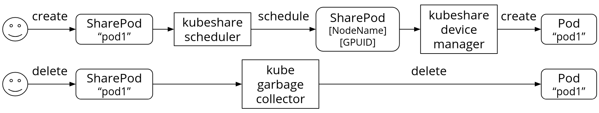

# KubeShare
Share GPU between Pods in Kubernetes

# Features
* Treat GPU as a first class resource.
* Compatible with native "nvidia.com/gpu" system.
* Extensible architecture supports custom scheduling policies without modifing KubeShare.

## Prerequisite & Limitation
* A Kubernetes cluster with [garbage collection](https://kubernetes.io/docs/concepts/workloads/controllers/garbage-collection/), [DNS enabled](https://kubernetes.io/docs/concepts/services-networking/dns-pod-service/), and [Nvidia GPU device plugin](https://kubernetes.io/docs/tasks/manage-gpus/scheduling-gpus/#deploying-nvidia-gpu-device-plugin) installed.
* Only support a kubernetes cluster that uses the environment variable `NVIDIA_VISIBLE_DEVICES` to control which GPUs will be made accessible inside the container.
* One GPU model within one node.
* cuda == 10.0 (other version not tested)

<!--
* GPU attachment setting of container should be going through NVIDIA_VISIBLE_DEVICES environment variable (docker and nvidia-docker2 version < 19).
-->

<!--
## CUDA Version Compatibility
|CUDA Version|Status|
|-|-|
|9.0|Unknown|
|9.1|Unknown|
|9.2|Unknown|
|10.0|Yes|
|10.1|Unknown|
|10.2|Unknown|
-->

## Run

### Installation
```
cd ./deploy
kubectl apply -f .
```

### Uninstallation
```
cd ./deploy
kubectl delete -f .
```

## SharePod

### SharePod Lifecycle



1. User create a SharePod to requiring portion GPU.
2. kubeshare-scheduler schedules pending SharePods.
3. kubeshare-device-manager will create a corresponding Pod object behind the SharePod with same namespace and name, and some extra critical settings. (Pod started to run)
4. kubeshare-device-manager will synchronize Pod's ObjectMeta and PodStatus to SharePodStatus.
4. SharePod was deleted by user. (Pod was also garbage collected by K8s)

### SharePod Specification
```
apiVersion: kubeshare.nthu/v1
kind: SharePod
metadata:
  name: sharepod1
  annotations:
    "kubeshare/gpu_request": "0.5" # required if allocating GPU
    "kubeshare/gpu_limit": "1.0" # required if allocating GPU
    "kubeshare/gpu_mem": "1073741824" # required if allocating GPU # 1Gi, in bytes
    "kubeshare/sched_affinity": "red" # optional
    "kubeshare/sched_anti-affinity": "green" # optional
    "kubeshare/sched_exclusion": "blue" # optional
spec: # PodSpec
  containers:
  - name: cuda
    image: nvidia/cuda:9.0-base
    command: ["nvidia-smi", "-L"]
    resources:
      limits:
        cpu: "1"
        memory: "500Mi"
```
Because floating point custom device requests is forbidden by K8s, we move GPU resource usage definitions to Annotations.
* kubeshare/gpu_request (required if allocating GPU): guaranteed GPU usage of Pod, gpu_request <= "1.0".
* kubeshare/gpu_limit (required if allocating GPU): maximum extra usage if GPU still has free resources, gpu_request <= gpu_limit <= "1.0".
* kubeshare/gpu_mem (required if allocating GPU): maximum GPU memory usage of Pod, in bytes.
* spec (required): a normal PodSpec definition to be running in K8s.
* kubeshare/sched_affinity (optional): only schedules SharePod with same sched_affinity label or schedules to an idle GPU.
* kubeshare/sched_anti-affinity (optional): do not schedules SharedPods together which have the same sched_anti-affinity label.
* kubeshare/sched_exclusion (optional): only one sched_exclusion label exists on a device, including empty label.

### SharePod usage demo clip

All yaml files in clip are located in REPO_ROOT/doc/yaml.

[](https://asciinema.org/a/302443)

### SharePod with NodeName and GPUID (advanced)
Follow this section to understand how to locate a SharePod on a GPU which is used by others.  
kubeshare-scheduler fills metadata.annotations["kubeshare/GPUID"] and spec.nodeName to schedule a SharePod.
```
apiVersion: kubeshare.nthu/v1
kind: SharePod
metadata:
  name: sharepod1
  annotations:
    "kubeshare/gpu_request": "0.5"
    "kubeshare/gpu_limit": "1.0"
    "kubeshare/gpu_mem": "1073741824" # 1Gi, in bytes
    "kubeshare/GPUID": "abcde"
spec: # PodSpec
  nodeName: node01
  containers:
  - name: cuda
    image: nvidia/cuda:9.0-base
    command: ["nvidia-smi", "-L"]
    resources:
      limits:
        cpu: "1"
        memory: "500Mi"
```
A GPU is shared between multiple SharePods if the SharePods own the same <nodeName, GPUID> pair.

Following is a demonstration about how kubeshare-scheduler schedule SharePods with GPUID mechanism in a single node with two physical GPUs:
```
Initial status

GPU1(null)       GPU2(null)
+--------------+ +--------------+
|              | |              |
|              | |              |
|              | |              |
+--------------+ +--------------+

Pending list: Pod1(0.2)
kubeshare-scheduler decides to bind Pod1 on an idle GPU:
    randomString(5) => "zxcvb"
    Register Pod1 with GPUID: "zxcvb"

GPU1(null)       GPU2(zxcvb)
+--------------+ +--------------+
|              | |   Pod1:0.2   |
|              | |              |
|              | |              |
+--------------+ +--------------+

Pending list: Pod2(0.3)
kubeshare-scheduler decides to bind Pod2 on an idle GPU:
    randomString(5) => "qwert"
    Register Pod2 with GPUID: "qwert"

GPU1(qwert)      GPU2(zxcvb)
+--------------+ +--------------+
|   Pod2:0.3   | |   Pod1:0.2   |
|              | |              |
|              | |              |
+--------------+ +--------------+

Pending list: Pod3(0.4)
kubeshare-scheduler decides to share the GPU which Pod1 is using with Pod3:
    Register Pod2 with GPUID: "zxcvb"

GPU1(qwert)      GPU2(zxcvb)
+--------------+ +--------------+
|   Pod2:0.3   | |   Pod1:0.2   |
|              | |   Pod3:0.4   |
|              | |              |
+--------------+ +--------------+

Delete Pod2 (GPUID qwert is no longer exist)

GPU1(null)       GPU2(zxcvb)
+--------------+ +--------------+
|              | |   Pod1:0.2   |
|              | |   Pod3:0.4   |
|              | |              |
+--------------+ +--------------+

Pending list: Pod4(0.5)
kubeshare-scheduler decides to bind Pod4 on an idle GPU:
    randomString(5) => "asdfg"
    Register Pod4 with GPUID: "asdfg"

GPU1(asdfg)      GPU2(zxcvb)
+--------------+ +--------------+
|   Pod4:0.5   | |   Pod1:0.2   |
|              | |   Pod3:0.4   |
|              | |              |
+--------------+ +--------------+
```

More details in [System Architecture](doc/architecture.md)

## Build

### Compiling
```
git clone https://github.com/NTHU-LSALAB/KubeShare.git
cd KubeShare
make
```
* bin/kubeshare-scheduler: schedules pending SharePods to node and device, i.e. <nodeName, GPUID>.
* bin/kubeshare-device-manager: handles scheduled SharePods and create the Pod object. Communicate with kubeshare-config-client on every nodes.
* bin/kubeshare-config-client: daemonset on every node which configure the GPU isolation settings.

### Directories & Files
* cmd/: where main function located of three binaries.
* crd/: CRD specification yaml file.
* docker/: materials of all docker images in yaml files
* pkg/: includes KubeShare core components, SharePod, and API server clientset produced by code-generater.
* code-gen.sh: [code-generator](https://github.com/kubernetes/code-generator) script.
* go.mod: KubeShare dependencies.

## GPU Isolation Library
Please refer to [Gemini](https://github.com/NTHU-LSALAB/Gemini).

# TODO
* Convert vGPU UUID update trigger method from dummy Pod creation handler to dummy Pod sending data to controller.  
* Add PodSpec.SchedulerName support to kubeshare-scheduler.
* Docker version check at init phase in config-client.

# Issues
Any issues please open a GitHub issue, thanks.

# Publication
Our paper is accepted by [ACM HPDC 2020](https://dl.acm.org/doi/10.1145/3369583.3392679), and an introduction video is also available on [YouTube](https://youtu.be/1WQMKCGN9j4).
