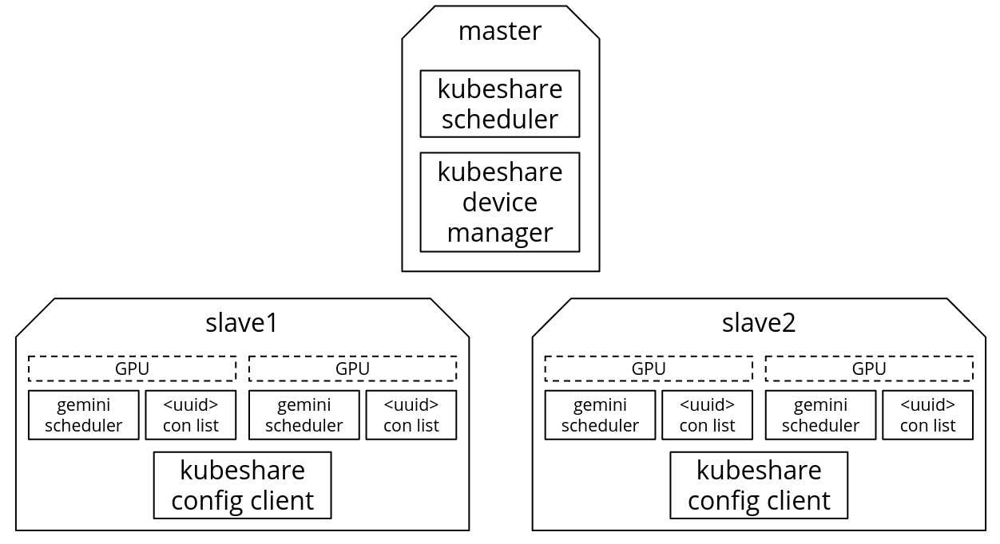
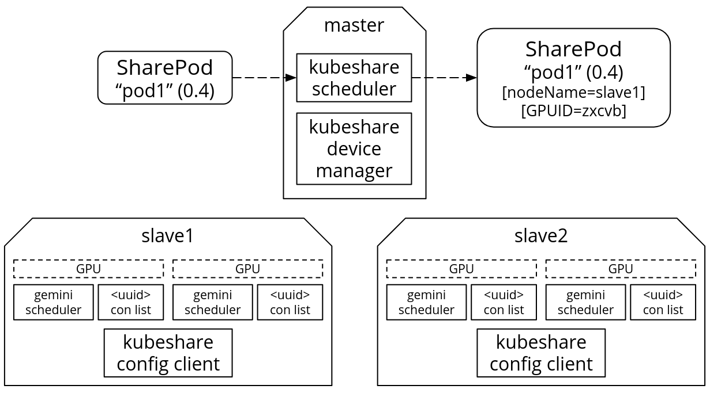
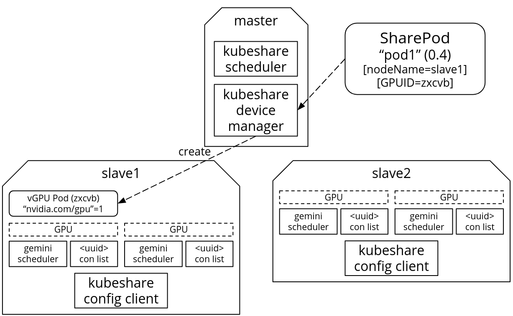
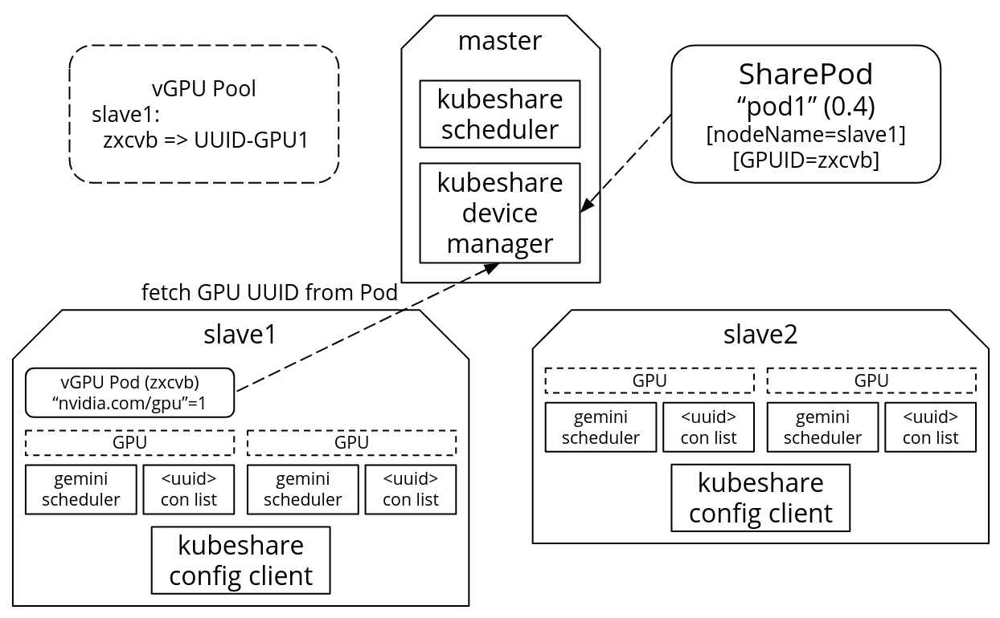
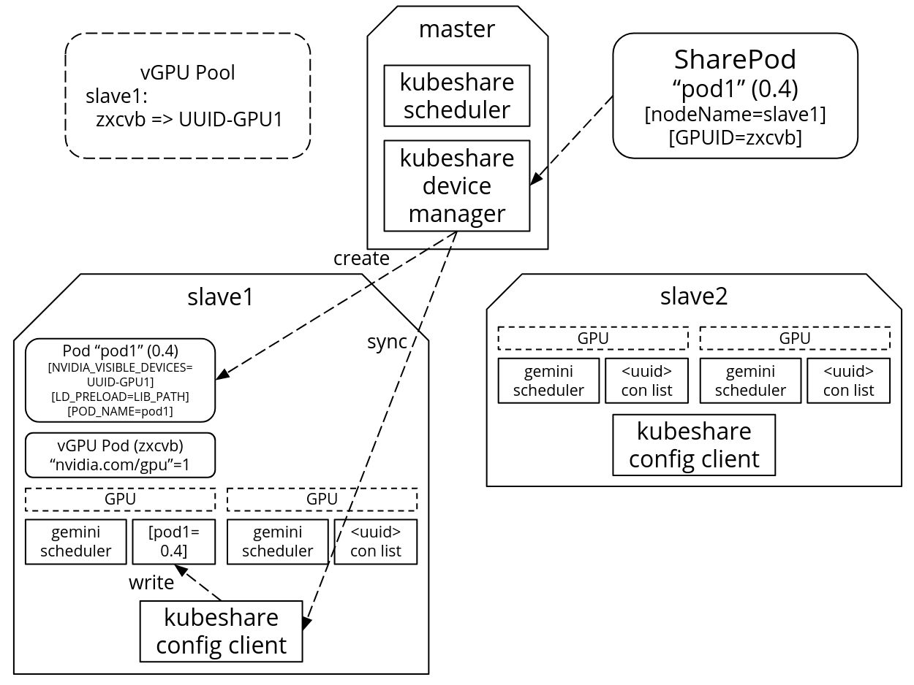
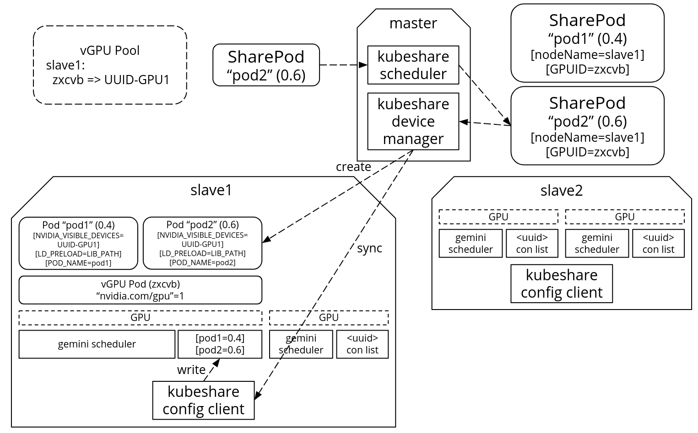
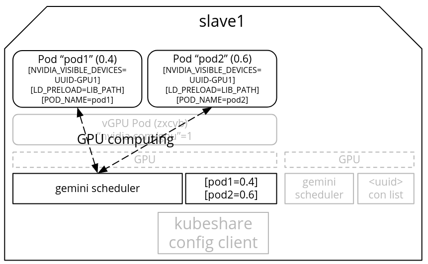

# System Architecture

## How system works? A workflow demo

1. Initialization stage: kubeshare-scheduler gets cluster resource. kubeshare-device-manager connects with kubeshare-config-client on every node. kubeshare-config-client writes the <GPU uuid> container list. gemini-scheduler synchronizes with <GPU uuid> container list.

2. A user creates a SharePod named 'pod1' requesting 0.4 GPU. kubeshare-scheduler can only locate pod1 on an idle GPU regardless of nodes. It picks slave1 and randomly generates a GPUID (zxcvb) then updates to pod1's spec.

3. kubeshare-device-manager notices that GPUID 'zxcvb' is a new GPUID on slave1, then it create a vGPU Pod which requires nvidia.com/gpu=1.

4. kubeshare-device-manager fetch the real GPU UUID 'UUID-GPU1' from vGPU Pod which is linked with the GPUID 'zxcvb'.

5. kubeshare-device-manager create a Pod named 'pod1' with multiple settings, including environment variables such as NVIDIA_VISIBLE_DEVICES=UUID-GPU1, LD_PRELOAD=GEMINI_LIB_PATH, POD_NAME=pod1.

6. Here comes another SharePod named 'pod2' requesting 0.6 GPU. kubeshare-scheduler decides to locate 'pod2' on a GPU which 'pod1' is using (best-fit algorithm). It update pod2's spec with nodeName=slave1 and GPUID=zxcvb. kubeshare-device-manager notices the GPUID 'zxcvb' has a corresponding GPU UUID. So kubeshare-device-manager can directly create a Pod named 'pod2' with settings same as 'pod1' (except the POD_NAME).

7. When Pods started running, the GPU function calls were intercepted by Gemini Library. These GPU computing requests were scheduled by gemini-scheduler one-by-one. More details can refer to [Gemini](https://github.com/NTHU-LSALAB/Gemini).

## KubeShare system workflow demo clip

All yaml files in clip are located in REPO_ROOT/doc/yaml.

